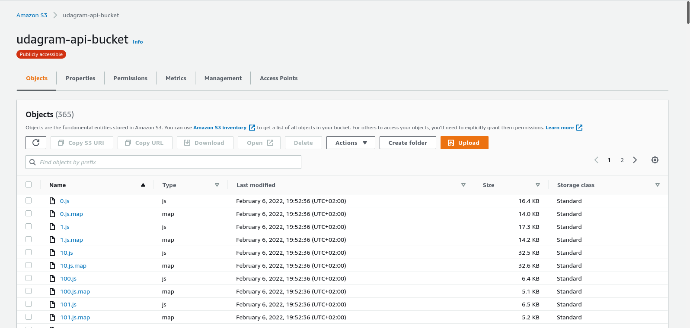

# Udagram

This application is fullstack app using Angular for the client-side and Express.js for node backend. The udagram application is a fairly simple application that includes all the major components of a Full-Stack web application.

You can try this app through this [url](http://udagram-api-bucket.s3-website-us-east-1.amazonaws.com).

## Getting Started

1. Clone this repo locally into the location of your choice.
1. Move the content of the udagram folder at the root of the repository as this will become the main content of the project.
1. Open a terminal and navigate to the root of the repo
1. follow the instructions in the installation step

The project can run but is missing some information to connect to the database and storage service, Simply copy and paste the following in udagram-api/.env (you need to create .env file first if it does not exist):

```
POSTGRES_HOST=
POSTGRES_USERNAME=
POSTGRES_PASSWORD=
POSTGRES_DB=
DB_PORT=
PORT=
URL=
JWT_SECRET=
```

and to use it with aws, you will need to add this information to your .env file:

```
RDS_DIALECT=
AWS_REGION=
AWS_PROFILE=
AWS_BUCKET=
```

### Dependencies

```
- Node v14.15.1 (LTS) or more recent. While older versions can work it is advisable to keep node to latest LTS version

- npm 6.14.8 (LTS) or more recent, Yarn can work but was not tested for this project

- AWS CLI v2, v1 can work but was not tested for this project

- A RDS database running Postgres.

- A S3 bucket for hosting uploaded pictures.

```

### Installation

Provision the necessary AWS services needed for running the application:

1. In AWS, provision a publicly available RDS database running Postgres. <Place holder for link to classroom article>
1. In AWS, provision a s3 bucket for hosting the uploaded files. <Place holder for tlink to classroom article>
1. Export the ENV variables needed or use a package like [dotnev](https://www.npmjs.com/package/dotenv).
1. From the root of the repo, navigate udagram-api folder `cd udagram-api` to install the node_modules `npm install`. After installation is done start the api in dev mode with `npm run dev`.
1. Without closing the terminal in step 1, navigate to the udagram-frontend `cd udagram-frontend` to intall the node_modules `npm install`. After installation is done start the api in dev mode with `npm run start`.

## Testing

This project contains two different test suite: unit tests and End-To-End tests(e2e). Follow these steps to run the tests.

1. `cd udagram-frontend`
2. `npm run test`
3. `npm run e2e`

There are no Unit test on the back-end

### Unit Tests:

Unit tests are using the Jasmine Framework.

### End to End Tests:

The e2e tests are using Protractor and Jasmine.

## Built With

- [Angular](https://angular.io/) - Single Page Application Framework
- [Node](https://nodejs.org) - Javascript Runtime
- [Express](https://expressjs.com/) - Javascript API Framework

## Infastructure

For this project, we used multible AWS services, including

1. Web server `Elastic Beanstak (EB)`: easy-to-use service for deploying and scaling web applications and services developed with Java, .NET, PHP, Node.js, Python, Ruby, Go, and Docker on familiar servers such as Apache, Nginx, Passenger, and IIS.
   

2. Web hosting `Simple Storage Services (S3)`: an object storage service that offers industry-leading scalability, data availability, security, and performance. Customers of all sizes and industries can use Amazon S3 to store and protect any amount of data for a range of use cases, such as data lakes, websites, mobile applications, etc.
   

3. Database `Relational Database Service (RDS)`: makes it easy to set up, operate, and scale a relational database in the cloud.
   

### Infrastructure diagram

The following diagram illustrates how frontend and backend communicate through aws infrastructure

## Pipeline process

Our pipline runs like the following steps


1. Add a feature or fix a bug
2. Gets pushed/merged to `main` branch
3. A circleci pipline is triggered
4. Circleci creates an environments with orbs:
   1. `node: circleci/node@4.7`
   2. `aws-cli: circleci/aws-cli@2.0.6`
   3. `eb: circleci/aws-elastic-beanstalk@1.0.0`
5. Then it installs node.js in the environmet
6. Setup aws-cli with circleci environment variables, like in the following image:
   
7. Then it starts the workflow:
   
   1. Install frontend dependencies
   2. Install backend dependencies
   3. Build the backend
   4. Build the frontend
   5. install pip
   6. Install AWS and EB dependencies
   7. Deploy the backend
   8. Deploy the frontend
      

## License

[License](LICENSE.txt)
